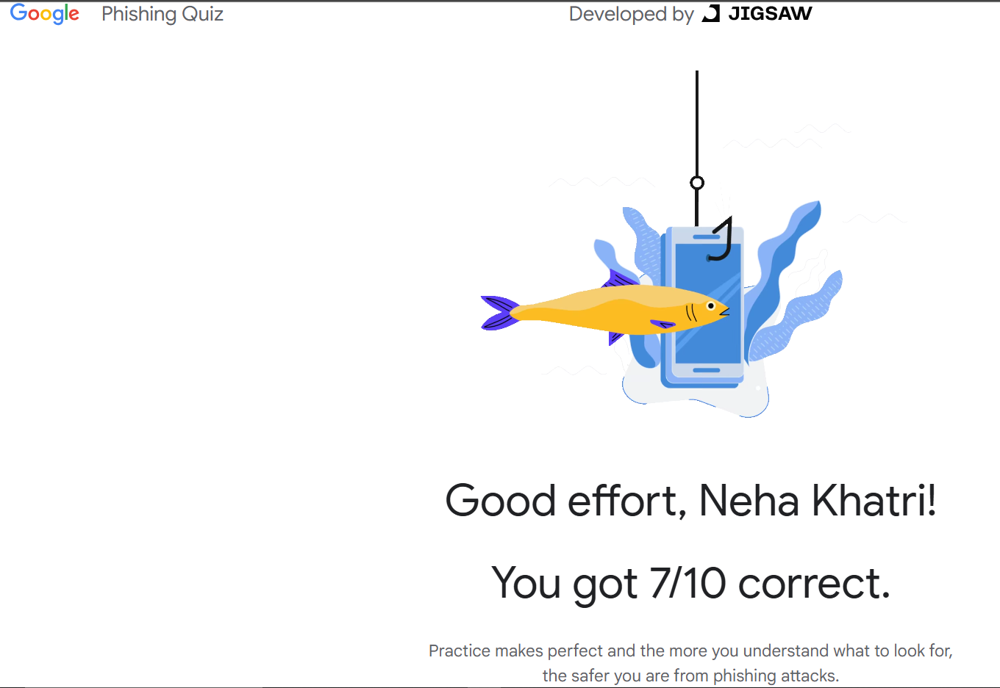

# 🎣 Task 3 – Identify Phishing Emails

---

## 📌 Task Objective

To learn how to recognize and safely handle phishing emails by understanding common red flags and practicing safe reporting techniques.

---

## 📖 What I Learned

- What phishing is and how it targets users via deceptive emails.
- Key signs to identify phishing emails.
- How to safely review suspicious emails without interacting with links.
- How to report phishing to email providers or security teams.

---

## 🛠️ Tools/Resources Used

- ✅ Google Phishing Quiz
- ✅ Gmail's “Report phishing” feature

---

## 🔄 Steps Performed

### 🔹 Step 1: Studied Common Signs of Phishing
- Urgent language: "Act now", "Your account is at risk"
- Suspicious links and mismatched domains
- Poor grammar or generic greetings
- Attachments from unknown senders

### 🔹 Step 2: Practiced with Google Phishing Quiz
- Used [https://phishingquiz.withgoogle.com](https://phishingquiz.withgoogle.com)
- Identified real vs fake emails based on headers, links, and tone

### 🔹 Step 4: Reported a Phishing Email
- Used Gmail’s "Report phishing" option to flag suspicious content

---

## 🖼️ Screenshots

1. ✅ **Google Phishing Quiz Results**  
   

2. ✅ **Reporting Phishing in Gmail**  
   

---

## 🎯 Outcome

After completing this task, I am confident in spotting suspicious emails and understanding how phishing works. I practiced identifying red flags and learned how to report phishing attempts properly, contributing to safer email use in both personal and professional environments.

---
